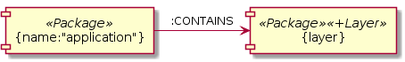

:toc:
:basedir: .
= jQAssistant PlantUML Rule Plugin

This project provides a http://jqassistant.org/[jQAssistant] plugin for embedding http://plantuml.com/[PlantUML] diagrams into Asciidoc documents that are interpreted as rules, i.e. concepts or constraints.

A component diagram with the source...

....
[[example:Layer]]
[plantuml,layer,role=concept]
----
@startuml
[{name:"application"}] as root  <<Package>>
[{layer}]              as layer <<Package>><<(+) Layer>>

root -right-> layer : :CONTAINS
@enduml
----
....

...is rendered to...

...and adds a label `Layer` to all packages contained in the package `application`.

== Setup

=== Prerequisites

- Java 8
- jQAssistant 1.6.0

=== Maven

Add the plugin as dependency to the jQAssistant Maven plugin:

.pom.xml
[source,xml]
----
<plugin>
    <groupId>com.buschmais.jqassistant</groupId>
    <artifactId>jqassistant-maven-plugin</artifactId>
    <version>1.6.0</version>
    <executions>
        <execution>
            <id>default-cli</id>
            <goals>
                <goal>scan</goal>
                <goal>analyze</goal>
            </goals>
            <configuration>
                <reportProperties>
                    <!-- Configuration for the Asciidoc report plugin -->
                    <asciidoc.report.rule.directory>${session.topLevelProject.basedir}/jqassistant</asciidoc.report.rule.directory>
                    <asciidoc.report.file.include>index.adoc</asciidoc.report.file.include>
                </reportProperties>
            </configuration>
        </execution>
    </executions>
    <dependencies>
        <!-- PlantUML rule plugin -->
        <dependency>
            <groupId>org.jqassistant.contrib.plugin</groupId>
            <artifactId>jqassistant-plantuml-rule-plugin</artifactId>
            <version>1.6.0</version>
        </dependency>
        <!-- Asciidoc report plugin -->
        <dependency>
            <groupId>org.jqassistant.contrib.plugin</groupId>
            <artifactId>jqassistant-asciidoc-report-plugin</artifactId>
            <version>1.6.0</version>
        </dependency>
    </dependencies>
</plugin>
----

For using the plugin with the command line distribution download the JAR file from https://search.maven.org/search?q=a:jqassistant-plantuml-rule-plugin[Maven Central] and copy it to the `plugins/` folder.

== Diagrams As Rules

=== Introduction

PlantUML supports a several types diagrams that are based on entities and relationships, e.g. component diagrams and class diagrams.
The elements of such diagrams are interpreted as graph patterns and translated into Cypher queries.

Using the graph patterns it is possible to...

- match nodes and relationships by labels or type, filtering by properties is supported as well
- add labels to nodes
- create relationships between nodes

=== Nodes

- Diagram nodes and groups are interpreted as nodes
- Stereotypes are used as labels, e.g. `\<<Type>>`
- A stereotype may start with a modifier `(+)` indicating that a label shall be added, e.g. `<<(+) Entity>>`
- The description of a node may contain an alias and a filter, e.g. `a {name: 'a'}`, both are optional
- If an alias is specified then it will be returned by the query

.Example
----
[root {name:"application"}] as r <<Package>> <<(+) Root>>
----
- Filter for nodes labeled with `Package` and a property `name` with the value `application`
- Add a label `Root` to matching nodes
- Return the matching nodes as `root`

=== Relationships

- The description of a relationship may contain a modifier, an alias, a type and a filter, e.g. `d:DEPENDS_ON{virtual:true}` or `+d1:DEFINES_DEPENDENCY`
- If the modifier `(+)` is provided a new relation of the given type is created, otherwise the relation is used for filtering

.Relationship example 1
----
[type1] as t1 <<Class>>
[type2] as t2 <<Class>>
[type3] as t3 <<Class>>

t1 --> t2 : d:DEPENDS_ON
t1 --> t3 : d:DEPENDS_ON{virtual:true}
----
- Filter for relationships of type `DEPENDS_ON` between nodes `t1` and `t2`
- Filter for relationships of type `DEPENDS_ON` having the property `virtual` with the value `true` between nodes `t1` and `t3`
- Return the nodes `t1`, `t2`, `t3` and the relationship `d`

.Example
----
b -right-> a : (+) d1:DEFINES_DEPENDENCY
----
- Add a relationship of type `DEFINES_DEPENDENCY` between nodes `b` and `a`
- Return the created relationships as `d1`

=== Examples

==== PlantUML Rules In Asciidoc Files

To use PlantUML rules in Asciidoc files a `plantuml` source block must be used as supported by https://asciidoctor.org/docs/asciidoctor-diagram/#creating-a-diagram[Asciidoctor Diagram].
Furthermore an id and role attribute are required, other jQAssistant attributes like `requiresConcepts` or `reportType` may be used if needed:

....
[[example:RootPackage]]
[plantuml,root-package,role=concept]
.The package named `root` is labeled with `Root`.
----
@startuml
skinparam componentStyle uml2

[root {name:"root"}] as r <<Package>> <<(+) Root>>

@enduml
----
....

==== Component Diagram

The following component diagram demonstrates...

- matching of Java packages
- and adding relationships

...for specifying the defined dependencies of a layered architecture:

[[plantuml-rule:ComponentDiagram]]
[plantuml,ComponentDiagram,role=concept]
.The root package contains the components `A`, `B` and `C` with defined dependencies between them.
----
@startuml
skinparam componentStyle uml2

[root {name:"root"}] as r <<Package>> <<(+) Root>>

[a {name:"a"}] as a <<Package>> <<(+) Module>>
[b {name:"b"}] as b <<Package>> <<(+) Module>>
[c {name:"c"}] as c <<Package>> <<(+) Module>>

r -down-> a : :CONTAINS
r -down-> b : :CONTAINS
r -down-> c : :CONTAINS

b -right-> a : (+) d1:DEFINES_DEPENDENCY
c -left->  a : (+) d2:DEFINES_DEPENDENCY

@enduml
----

The rule above...

- Matches for a package named `root` and adds a label `Root` to it
- Matches contained packages named `a`, `b`, `c` and adds a label `Module` to them
- Creates relationships `b -> a` and `c -> a` of type `DEFINES_DEPENDENCY`
- Returns the nodes with the aliases `root`, `a`, `b`, `c` as well as the created relationships `d1` and `d2`.
  The aliases are defined in the description of the nodes or relationships.

The example is translated into a Cypher query like this:

[source,cypher]
----
MATCH
  (root:Package{name:"root"}),
  (a:Package{name:"a"}),
  (b:Package{name:"b"}),
  (c:Package{name:"c"}),
  (root)-[:CONTAINS]->(a),
  (root)-[:CONTAINS]->(b),
  (root)-[:CONTAINS]->(c)
SET
  root:Root
SET
  a:Module
SET
  b:Module
SET
  c:Module
MERGE
  (b)-[d1:DEFINES_DEPENDENCY]->(a)
MERGE
  (c)-[d2:DEFINES_DEPENDENCY]->(a)
RETURN
  root, a, b, c, d1, d2
----

==== Component Diagram Without Aliases

The same diagram may be specified without aliases in the descriptions of nodes and relationships.

[[plantuml-rule:ComponentDiagramWithoutAliases]]
[plantuml,ComponentDiagramWithoutAliases,role=concept]
.The root package contains the components `A`, `B` and `C` with defined dependencies between them.
----
@startuml
skinparam componentStyle uml2

[{name:"root"}] as r <<Package>> <<(+) Root>>

[{name:"a"}] as a <<Package>> <<(+) Module>>
[{name:"b"}] as b <<Package>> <<(+) Module>>
[{name:"c"}] as c <<Package>> <<(+) Module>>

r -down-> a : :CONTAINS
r -down-> b : :CONTAINS
r -down-> c : :CONTAINS

b -right-> a : (+) :DEFINES_DEPENDENCY
c -left->  a : (+) :DEFINES_DEPENDENCY

@enduml
----

In this case the generated Cypher query will only return the count of result rows (i.e. matching patterns):

[source,cypher]
----
MATCH
  (cl0100:Package{name:"root"}),
  (cl0101:Package{name:"a"}),
  (cl0102:Package{name:"b"}),
  (cl0103:Package{name:"c"}),
  (cl0100)-[:CONTAINS]->(cl0101),
  (cl0100)-[:CONTAINS]->(cl0102),
  (cl0100)-[:CONTAINS]->(cl0103)
SET
  cl0100:Root
SET
  cl0101:Module
SET
  cl0102:Module
SET
  cl0103:Module
MERGE
  (cl0102)-[:DEFINES_DEPENDENCY]->(cl0101)
MERGE
  (cl0103)-[:DEFINES_DEPENDENCY]->(cl0101)
RETURN
  count(*) as Count
----

NOTE: The aliases used within the query (e.g. `cl0100`) are generated and there's no guarantee about the used format.

==== Component Diagram With Folders

It is possible to use folders which are interpreted as nodes:

[[plantuml-rule:NestedPackageDiagram]]
[plantuml,NestedPackageDiagram,role=concept]
.The package named "root" is labeled with `Root` and contains packages representing the layers of the application. They are labeled with `Layer`.
----
@startuml
skinparam componentStyle uml2

package "{name:'root'}" as root <<Package>> <<(+) Root>> {
  package "layer" as layer <<Package>> <<(+) Layer>>
}

root -> layer : :CONTAINS

@enduml
----

The resulting query will be as follows:

[source,cypher]
----
MATCH
  (cl0069:Package{name:'root'}),
  (layer:Package),
  (cl0069)-[:CONTAINS]->(layer)
SET
  cl0069:Root
SET
  layer:Layer
RETURN
  layer
----

==== Class Diagram

The described rules for component diagrams apply for class diagrams as well:

[[plantuml-rule:ClassDiagram]]
[plantuml,ClassDiagram,role=concept]
.A class diagram
----
@startuml

skinparam componentStyle uml2

class "{name:"AbstractEntity"}" as abstractEntity <<Type>>
class "entity" as entity <<Class>> <<(+) Entity>>

entity -up-|> abstractEntity  : :EXTENDS*

@enduml
----
- Filter for nodes labeled with `Type` having the name `AbstractEntity`
- Filter for `entity` nodes having a relationship of type `EXTENDS*` (i.e. allowing multiple hops) to the abstract entity
- Add a label `Entity` to all entities and return them

